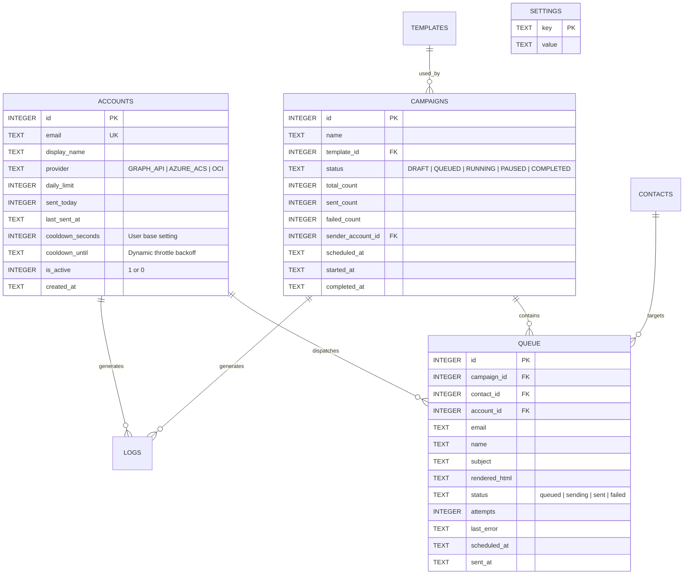
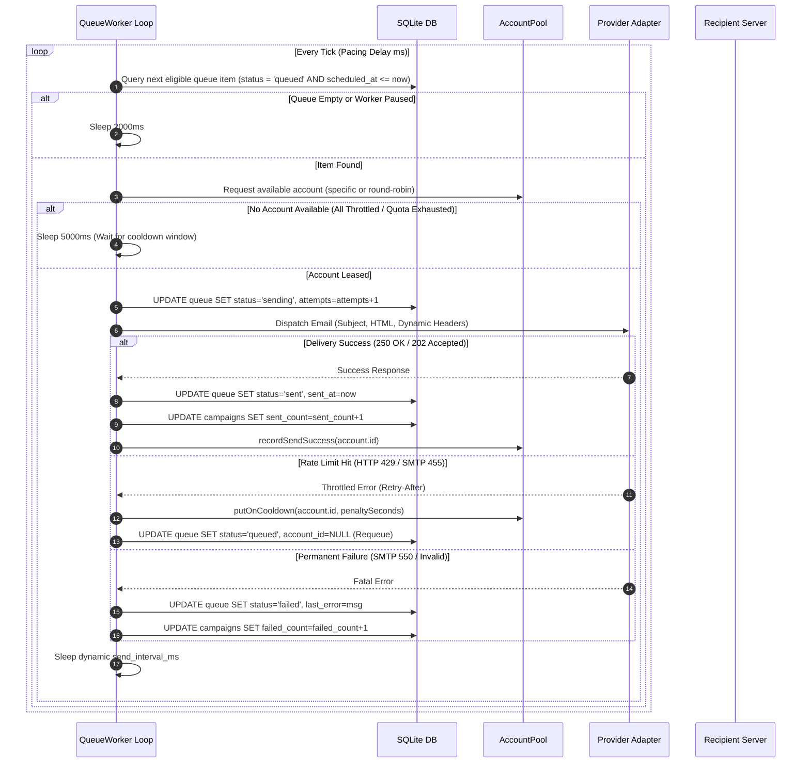
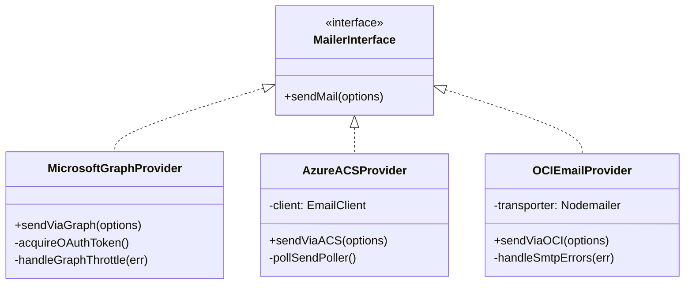

# 🏛️ Complete System Design & Architecture Deep-Dive: Enterprise Multi-Sender Dispatch Platform

> **Standard**: Architected in strict conformance to [roadmap.sh System Design](https://roadmap.sh/system-design) blueprints and battle-tested open-source MTA patterns ([Postal](https://postalserver.io), [Listmonk](https://listmonk.app), RFC 5321, RFC 5322).
> **Target Deployments**: Azure App Service Linux (B1 tier) & Oracle Cloud Infrastructure (OCI Always Free VPS / Ampere A1).

---

## 🗺️ 1. Global Architectural Overview

The platform is designed as an **event-driven, hexagonal multi-provider email dispatch engine**. It decouples campaign management, template compilation, and queuing from the underlying delivery networks (`Microsoft Graph API`, `Azure Communication Services`, and `Oracle Cloud Infrastructure Email Delivery`).

```mermaid
flowchart TD
    subgraph Layer1["1. PRESENTATION LAYER (Responsive SPA)"]
        UI_HUD["Real-Time Dispatch HUD<br/>• Pipeline Status & Concurrency<br/>• Rolling 24h Quota Fuel Gauge<br/>• Dynamic Link Status"]
        UI_AccountMgr["Connection-Aware Account Pool Manager<br/>• Inline Status Toggles<br/>• Modal & In-Place Quota Editor<br/>• Provider Guidance Badges"]
        UI_Presets["1-Click Quota Presets<br/>• [500 Graph Safe]<br/>• [2,000 Standard]<br/>• [4,000 High Volume]<br/>• [10,000 OCI PAYG]"]
        UI_CampaignMgr["Campaign & Batch Dispatcher<br/>• Drag & Drop CSV / Excel Importer<br/>• Auto-Chunking (50 Contacts / Batch)<br/>• 1-Click Retry Failed & Clear Queue"]
    end

    subgraph Layer2["2. API GATEWAY & CONTROLLER TIER (Express.js)"]
        API_Campaigns["/api/campaigns/*<br/>(Create, Batch Launch, Clone, Pause, Resume, Delete)"]
        API_Accounts["/api/accounts/*<br/>(List, Create, Update, Delete, Toggle Active)"]
        API_Settings["/api/settings/*<br/>(GET/POST Pacing Delay, Bulk Quotas, Engine State)"]
        API_Queue["/api/queue/*<br/>(Live Pipeline, Retry Failed, Clear Completed)"]
        API_Templates["/api/templates/*<br/>(CRUD Templates with Merge Tags)"]
    end

    subgraph Layer3["3. BUSINESS DOMAIN & QUEUE ENGINE"]
        AccountPool["AccountPool Manager<br/>• Fair Round-Robin Rotation<br/>• Rolling 24h Window Check<br/>• Decoupled Cooldown & Backoff"]
        QueueWorker["QueueWorker Background Engine<br/>• Leaky-Bucket Rate Pacer (10ms - 6500ms)<br/>• Non-blocking Async Loop<br/>• Crash Recovery & Auto-Pause"]
        TemplateEngine["Template Engine & Link Resolver<br/>• Merge Tag Interpolator ({{Name}}, etc.)<br/>• Dynamic {{senderDomain}} Rewriter<br/>• Relative URL to Absolute Host Rewriter"]
        CircuitBreaker["RFC 5321 Circuit Breaker<br/>• HTTP 429 & SMTP 455 Backoff<br/>• Transient 4xx Requeue<br/>• Permanent 5xx Quarantine"]
    end

    subgraph Layer4["4. PERSISTENCE & STORAGE TIER (Native SQLite WAL)"]
        DB_Schema["SQLite WAL Engine (/data/mailer.db)<br/>• PRAGMA journal_mode = WAL<br/>• PRAGMA busy_timeout = 5000<br/>• PRAGMA synchronous = NORMAL"]
        T_Accounts[("accounts Table<br/>(id, email, display_name, provider, daily_limit,<br/>sent_today, last_sent_at, cooldown_seconds,<br/>cooldown_until, is_active)")]
        T_Queue[("queue Table<br/>(id, campaign_id, account_id, email, status,<br/>attempts, last_error, scheduled_at, sent_at)")]
        T_Campaigns[("campaigns Table<br/>(id, name, template_id, status, total_count,<br/>sent_count, failed_count, scheduled_at)")]
        T_Settings[("settings Table<br/>(key, value) - Single Source of Truth")]
        T_Contacts[("contacts Table & logs Table")]
    end

    subgraph Layer5["5. HEXAGONAL CONNECTION ADAPTERS"]
        Adapter_Graph["MicrosoftGraphProvider<br/>• REST API / Mail.Send<br/>• Hard Cap: 30 msgs/min per mailbox<br/>• Daily Cap: 500 - 10,000/day<br/>• Base Cooldown: 60s"]
        Adapter_ACS["AzureACSProvider<br/>• Azure Communication SDK<br/>• Concurrency: 100 msgs/sec<br/>• Daily Cap: 10k - 100k+/day (PAYG)<br/>• Base Cooldown: 0s"]
        Adapter_OCI["OCIEmailProvider<br/>• Authenticated SMTP (Port 587/2525)<br/>• Concurrency: 1,500+ msgs/sec<br/>• Daily Cap: Unlimited (PAYG)<br/>• Base Cooldown: 0s (Sandbox: 6.5s)"]
    end

    subgraph Layer6["6. EXTERNAL INBOX NETWORKS"]
        Inboxes["Google Workspace, Microsoft 365, Yahoo, Academic / Institutional (.edu / .ac)"]
    end

    Layer1 -->|HTTP REST JSON| Layer2
    Layer2 --> Layer3
    Layer3 <-->|ACID Atomic Transactions| Layer4
    Layer3 --> Layer5
    Layer5 --> Layer6
```



---

## 💾 2. Persistence Tier: Native SQLite WAL Architecture

The persistence tier uses Node.js 24 native SQLite (`node:sqlite`). This eliminates external C++ native addon compilation issues (such as `node-gyp` or Python compilation dependencies) while delivering microsecond read latency and ACID transaction guarantees.

### 2.1 Pragmas & Performance Configuration
```sql
PRAGMA journal_mode = WAL;          -- Concurrent reads while writes occur
PRAGMA busy_timeout = 5000;         -- Wait up to 5s on lock contention
PRAGMA synchronous = NORMAL;        -- Max speed with zero data loss on WAL
PRAGMA cache_size = -64000;         -- 64MB RAM cache
PRAGMA foreign_keys = ON;           -- Enforce cascading constraints
```

### 2.2 Relational Data Model (Schema Deep-Dive)



### 2.3 Indexing Strategy
To ensure constant time $O(1)$ queue consumption even with $100,000+$ records:
1. `idx_queue_status_id ON queue(status, id)`: Powers the queue worker's next-item selector.
2. `idx_queue_schedule ON queue(status, scheduled_at, id)`: Ensures scheduled future campaigns remain dormant until target timestamp.
3. `idx_queue_sent_at ON queue(status, sent_at)`: Instant 24-hour rolling quota aggregation per sender.
4. `idx_accounts_active ON accounts(is_active, sent_today, last_sent_at)`: Instant round-robin candidate extraction.

---

## 🔄 3. Account Pool Manager (`src/services/accountPool.js`)

The Account Pool solves the cold-outreach reputation paradox: **sending thousands of emails per day while ensuring no individual mailbox trips spam filters or rate limits.**

### 3.1 Round-Robin Rotation Algorithm
The algorithm selects the healthiest account satisfying all three operational constraints:
1. **Activity Constraint**: `is_active = 1`
2. **24-Hour Rolling Quota Constraint**: `sent_today < daily_limit`
3. **Pacing & Throttle Constraints**:
   - `cooldown_until IS NULL OR strftime('%s', 'now') >= strftime('%s', cooldown_until)`
   - `cooldown_seconds = 0 OR last_sent_at IS NULL OR (strftime('%s', 'now') - strftime('%s', last_sent_at)) >= cooldown_seconds`

```sql
SELECT * FROM accounts
WHERE is_active = 1
  AND sent_today < daily_limit
  AND (
    cooldown_until IS NULL
    OR strftime('%s', 'now') >= strftime('%s', cooldown_until)
  )
  AND (
    cooldown_seconds = 0
    OR last_sent_at IS NULL
    OR (strftime('%s', 'now') - strftime('%s', last_sent_at)) >= cooldown_seconds
  )
ORDER BY last_sent_at ASC
LIMIT 1;
```

### 3.2 Rolling 24-Hour Quota Enforcement (Sliding Window)
Instead of resetting quotas at midnight (which causes massive dispatch spikes at 00:01 AM), the system recalculates sends over a **true sliding 24-hour window**:
```sql
UPDATE accounts
SET sent_today = (
  SELECT COUNT(*)
  FROM queue
  WHERE queue.account_id = accounts.id
    AND queue.status = 'sent'
    AND queue.sent_at >= datetime('now', '-24 hours')
);
```

### 3.3 Decoupled Dynamic Throttling vs. Base Cooldown
- **Base Cooldown (`cooldown_seconds`)**: Represents the permanent operator-configured pacing (e.g. 60s for Graph, 0s for OCI).
- **Temporary Penalty (`cooldown_until`)**: When a transient error occurs (such as HTTP 429 `Retry-After` or OCI SMTP 455 rate limit):
  ```sql
  UPDATE accounts
  SET last_sent_at = datetime('now'),
      cooldown_until = datetime('now', '+' || ? || ' seconds')
  WHERE id = ?;
  ```
  **Guarantee**: Base `cooldown_seconds` is never mutated. When `cooldown_until` expires, normal operation resumes automatically.

### 3.4 UI Authority & Idempotent Bootstrap (Zero Overwrite Guarantee)
When operators configure daily limits (e.g. 2k, 4k, 10k) in the UI, that configuration is permanently committed to SQLite. On server restarts or redeployments:
- `seedDefaultAccount()` strictly uses `INSERT ... WHERE NOT EXISTS`.
- `upsertAccount()` uses:
  ```sql
  INSERT INTO accounts (email, display_name, provider, daily_limit, cooldown_seconds, is_active)
  VALUES (?, ?, ?, ?, ?, 1)
  ON CONFLICT(email) DO UPDATE SET
    display_name = excluded.display_name,
    provider = excluded.provider,
    is_active = 1;
    -- Notice: daily_limit and cooldown_seconds are preserved!
  ```

---

## ⚙️ 4. Queue Worker & Rate Limiter Engine (`src/services/queueWorker.js`)

The Queue Worker runs an asynchronous, non-blocking event loop implementing a **Leaky-Bucket rate limiting model**.



### 4.1 Crash-Safe State Recovery
Upon server boot or worker initialization, orphaned in-flight tasks (`status = 'sending'`) are automatically recovered:
```sql
UPDATE queue
SET status = 'queued'
WHERE status = 'sending';
```
This guarantees zero lost emails if an Azure Web App or OCI instance restarts mid-flight.

### 4.2 Dynamic Pacing Control
The inter-message pacing delay is read dynamically from the `settings` table before every dispatch:
$$\text{Delay Interval} \in [10\text{ ms}, 6,500\text{ ms}]$$
Operators can adjust this value in real-time from the UI without restarting the worker.

---

## 🔌 5. Hexagonal Connection Adapters (Provider Specifications)



### 5.1 Provider Specifications Matrix

| Feature | 🔷 Microsoft Graph API (`GRAPH_API`) | ⚡ Azure Communication Services (`AZURE_ACS`) | 🏛️ Oracle Cloud Infrastructure (`OCI`) |
| :--- | :--- | :--- | :--- |
| **Protocol** | HTTPS REST (`/v1.0/users/{id}/sendMail`) | Azure REST SDK (`@azure/communication-email`) | Authenticated SMTP over TLS (Port 587 / 2525) |
| **Auth Mechanism** | Entra ID OAuth 2.0 Client Credentials | ACS Access Key / Connection String | IAM SMTP Credentials (User OCID + Password) |
| **Throughput Cap** | **30 messages / minute** per mailbox | **100 messages / second** | **1,500+ messages / second** (Enterprise PAYG) |
| **Daily Ceiling** | 10,000 / day per tenant mailbox | 10,000 to 100,000+ / day (PAYG) | Unlimited (PAYG); Sandbox: 2,000/day |
| **Safe Default Limit**| `500` (Warmup: 50–150; Mature: 2k–4k) | `10,000` | `10,000` to `50,000` |
| **Safe Base Cooldown**| `60` seconds | `0` seconds | `0` seconds (Sandbox: 6.5s) |
| **Transient Errors** | HTTP 429 (Retry-After header) | HTTP 429 / 503 | SMTP 421, 450, 451, 452, 455 |
| **Permanent Errors** | HTTP 400, 404, 550 5.7.708 | HTTP 401, Invalid Recipient | SMTP 550, 554 (Mailbox not found / Rejected) |
| **Reputation Risk** | `550 5.7.708` on unverified tenants | Cloud suppression list | Tenancy suspension if Bounce Rate $> 2\%$ |

---

## 📝 6. Dynamic Template Engine & Link Resolver (`src/services/templateEngine.js`)

### 6.1 Merge Tag Interpolation
Standard RFC 5322 tokens are compiled dynamically:
- `{{Name}}` $\to$ Contact's author or display name
- `{{Paper Title}}` $\to$ Target manuscript or research title
- `{{sender_email}}` $\to$ Active sending mailbox address
- `{{senderDomain}}` $\to$ Extracted host of the sending mailbox

### 6.2 Dynamic Domain Link Resolver
To eliminate cross-domain mismatch penalties (where email from domain `A` contains links pointing to domain `B`, triggering Phishing flags in Outlook and Gmail):
1. **Explicit Replacement**: Replaces all instances of `{{senderDomain}}` in link targets.
2. **Relative Link AST Converter**: Automatically scans HTML body for relative hyperlinks (`href="/submit"`) and converts them to fully qualified URLs matching the sending mailbox domain (`https://education.yourpaperpublication.com/submit`).

---

## 📊 7. Campaign Ingestion & Auto-Chunking Subsystem

```mermaid
flowchart LR
    CSV[Upload CSV / Excel Sheet] --> Parser[ExcelJS / CSV Stream Parser]
    Parser --> Dedupe[Deduplicate against contacts table]
    Dedupe --> Chunker[Auto-Chunk into Batches of 50]
    Chunker --> Batch1[Campaign_Batch_01 (50 recipients)]
    Chunker --> Batch2[Campaign_Batch_02 (50 recipients)]
    Chunker --> BatchN[Campaign_Batch_N (Remaining)]
    Batch1 & Batch2 & BatchN --> Queue[Atomic Queue Population]
```

### 7.1 Auto-Chunking Architecture
- High-volume cold campaigns must not be blasted as a single monolith of 5,000 emails.
- The engine automatically chunks uploaded sheets into micro-campaigns of **50 recipients** (e.g. `Cardiology_CFP_Batch_01`, `Cardiology_CFP_Batch_02`).
- Benefits:
  - Granular progress tracking.
  - Isolated pause and resume capability per batch.
  - Granular retry of failed batches without touching delivered contacts.

---

## 🌐 8. Complete REST API Gateway Specifications

| Method | Route | Description | Request Body / Parameters | Response Contract |
| :--- | :--- | :--- | :--- | :--- |
| `GET` | `/api/status` | Real-time worker HUD & pool status | None | `{ ok: true, worker: {...}, pool: {...} }` |
| `GET` | `/api/accounts` | List all accounts with live telemetry | None | `{ ok: true, accounts: [...] }` |
| `POST` | `/api/accounts` | Register a new sender in the pool | `{ email, displayName, provider, dailyLimit, cooldownSeconds }` | `{ ok: true, message: string }` |
| `PUT` | `/api/accounts/:id` | Update existing account settings | `{ displayName, provider, dailyLimit, cooldownSeconds, isActive }` | `{ ok: true, account: {...} }` |
| `DELETE`| `/api/accounts/:id` | Remove account from pool | URL param `:id` | `{ ok: true, message: string }` |
| `PATCH` | `/api/accounts/:id/toggle` | Toggle active / inactive state | URL param `:id` | `{ ok: true, is_active: 0\|1 }` |
| `GET` | `/api/settings` | Get current dynamic pacing delay | None | `{ ok: true, sendIntervalMs: number }` |
| `POST` | `/api/settings` | Set dynamic pacing delay (ms) | `{ sendIntervalMs: number }` | `{ ok: true, sendIntervalMs: number }` |
| `GET` | `/api/settings/engine` | Detailed engine telemetry & metrics | None | `{ ok: true, engine: {...}, poolMetrics: {...} }` |
| `POST` | `/api/settings/bulk-limits` | 1-Click bulk quota preset update | `{ dailyLimit: number, cooldownSeconds?: number, provider?: string }` | `{ ok: true, updatedCount: number }` |
| `GET` | `/api/campaigns` | List all campaigns & progress | None | `{ ok: true, campaigns: [...] }` |
| `POST` | `/api/campaigns/batch-launch` | Launch auto-chunked CSV batches | `{ baseCampaignName, templateId, batchSize, batches: [...] }` | `{ ok: true, campaignIds: [...] }` |
| `POST` | `/api/campaigns/:id/clone` | Re-run or clone campaign | `{ mode: 'failed_only' \| 'all', senderAccountId?: number }` | `{ ok: true, newCampaignId: number }` |
| `GET` | `/api/queue` | Live pipeline queue monitor | `?limit=50&status=queued` | `{ ok: true, queue: [...] }` |
| `POST` | `/api/queue/retry-failed` | 1-Click reset all failed to queued | None | `{ ok: true, count: number }` |
| `POST` | `/api/queue/clear-completed`| 1-Click purge sent items | None | `{ ok: true, count: number }` |
| `POST` | `/api/worker/pause` | Pause dispatch loop | None | `{ ok: true, isPaused: true }` |
| `POST` | `/api/worker/resume` | Resume dispatch loop | None | `{ ok: true, isPaused: false }` |

---

## 🖥️ 9. Presentation Tier: Single-Page Application (SPA)

The user interface is implemented as a high-performance vanilla JavaScript Single-Page Application (`public/index.html` and `public/js/app.js`):
1. **Zero External Framework Overhead**: Loads in $< 100\text{ms}$ with zero React/Vue bundle overhead.
2. **Polling Telemetry Engine**: Refreshes HUD metrics, active queue items, and account cards every 2,500ms.
3. **Account Editor Protection**:
   - Locked email key prevents accidental corruption of foreign key logs.
   - Dynamic provider guidance hints render immediately upon selecting `GRAPH_API`, `AZURE_ACS`, or `OCI`.
   - Switching providers in edit mode preserves custom limits (e.g. 2,000, 4,000).
4. **1-Click Bulk Preset Toolbar**:
   - `[🛡️ Set All: 500 (Graph Safe)]`
   - `[⚡ Set All: 2,000 (Standard)]`
   - `[🚀 Set All: 4,000 (High Volume)]`
   - `[🏛️ Set All: 10,000 (Enterprise OCI)]`

---

## 🛡️ 10. Deliverability, Warmup & Compliance Playbook

### 10.1 DNS Authentication Standard (Per Sending Domain)
Every sending domain configured in the pool must have 3 DNS records:
1. **SPF (Sender Policy Framework)**:
   ```
   v=spf1 include:spf.protection.outlook.com include:azurecomm.net include:spfa.oraclemail.com ~all
   ```
2. **DKIM (DomainKeys Identified Mail)**:
   - 2048-bit CNAME records pointing to the respective provider's signing servers.
3. **DMARC (Domain-based Message Authentication)**:
   ```
   v=DMARC1; p=quarantine; rua=mailto:dmarc-reports@yourpaperpublication.com; pct=100
   ```

### 10.2 Google & Yahoo Bulk Sender Thresholds
- **Spam Complaint Rate**: Must remain strictly below **$0.3\%$** (ideal: $< 0.1\%$).
- **Hard Bounce Rate**: Must remain strictly below **$2\%$**. Any campaign exceeding 2% hard bounces must be paused to scrub the list.
- **Unsubscribe Link**: One-click unsubscribe header must be present in cold marketing templates.

---

## 🚀 11. Production Deployment & Runtime Commands

### Running Locally / Development
```powershell
npm install
node src/app.js
```

### Running Automated Test Suite
```powershell
node tests/connection-limits-test.js
node tests/extension-features-test.js
node tests/app-smoke-test.js
```

### Production Hosting on Azure App Service (B1 Linux)
- Environment variable `PORT=5000` or `PORT=80`.
- Persistent storage mounted at `/home/data` for SQLite database.
- `Always On` enabled on B1 tier to keep queue worker executing 24/7 without idle shutdown.
